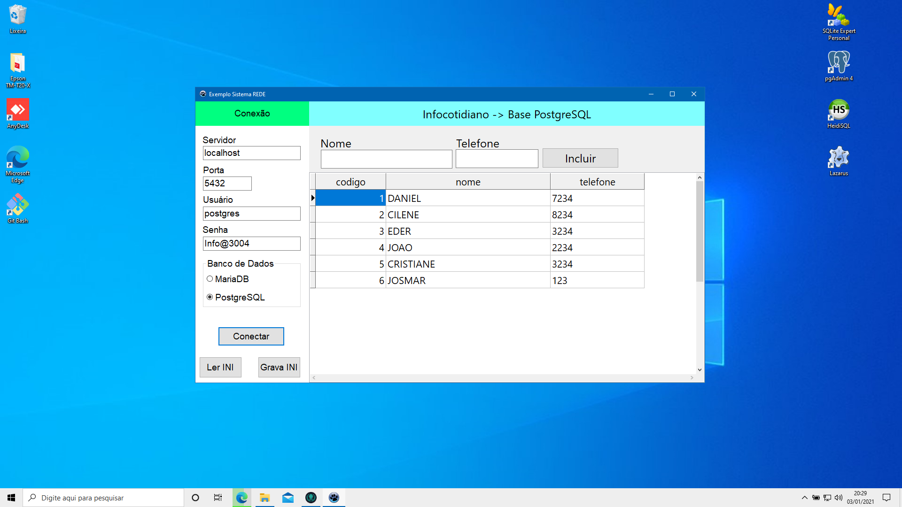

<<<<<<< Updated upstream
<<<<<<< refs/remotes/origin/main
# Lazarus - Multi Bancos
## PROGRAMA: Teste de Conexão MariaDB e PostgreSQL

# IDE LAZARUS (Pascal)

# Autor: DANIEL DE MORAIS (https://www.youtube.com/user/infocotidiano/)

Os inscritos do canal pedem como configurar na rede banco de dados. 
Então criei uma aplicação em Lazarus (funciona em delphi usando mesma logica) onde seleciono o banco e servidor que quero conectar. 
Posso testar inclusão, exclusão de registros (ctrl + del). 
Dll dentro da pasta do Programa.
Bancos utilizados MariaDB 10.5 e PostgreSQL 13.1

### Link para o meu video: (https://youtu.be/AxQcr4GyfyI)
=======
# MultiBancos
# MultiBancos
>>>>>>> atualização
=======
#PRIMEIRA VERSAO
DANIEL
>>>>>>> Stashed changes
